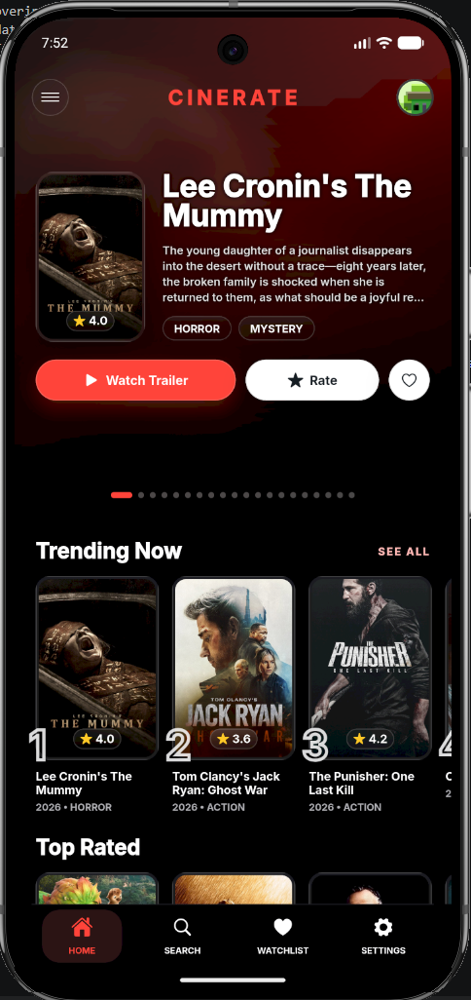
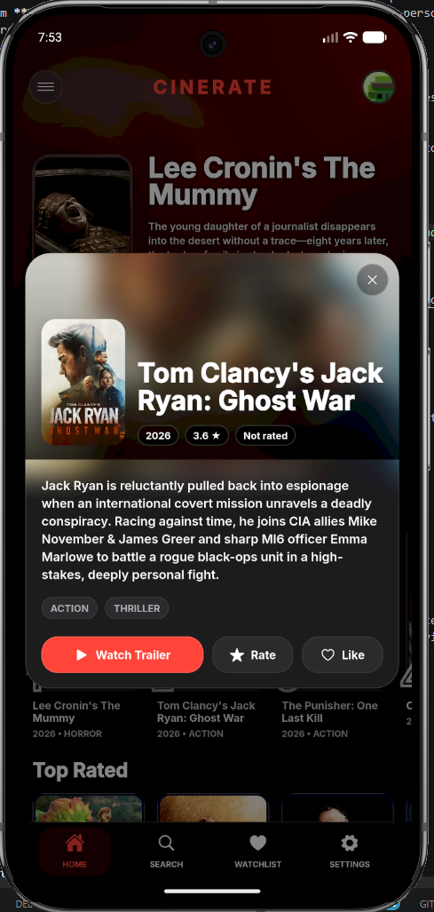
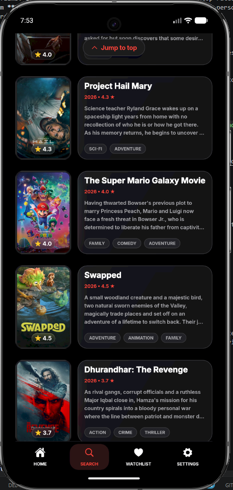
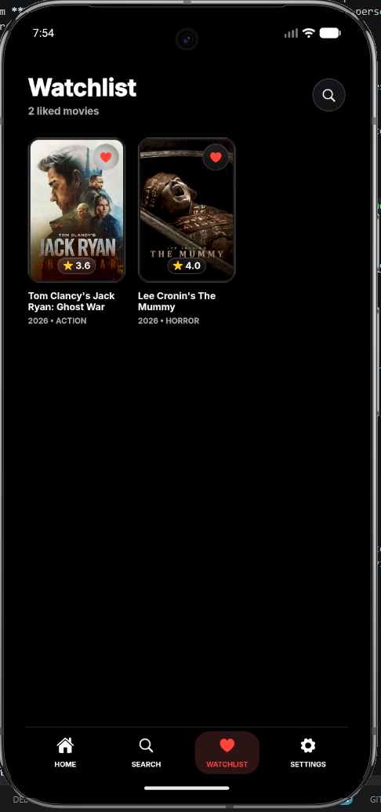
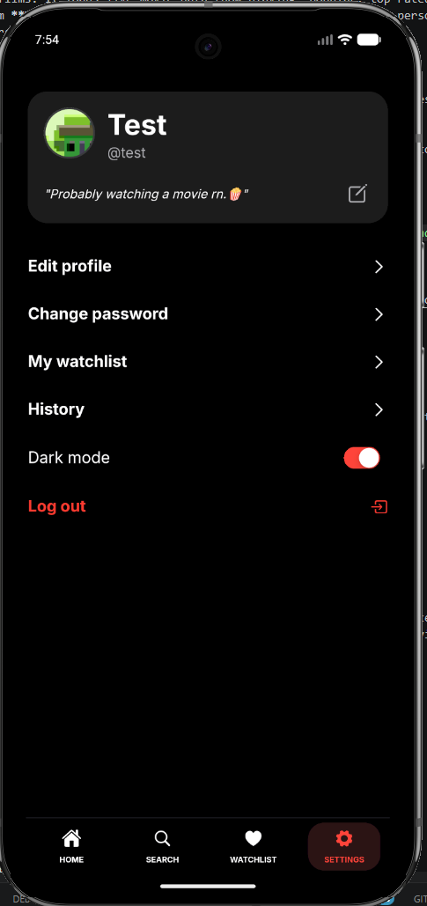

# CINERATE 

CINERATE is a Flutter movie app for discovering, searching, rating, and
watchlisting films. It loads live movie data (now playing, popular, top rated,
by genre) from **TheMovieDB (TMDB)** REST API and lets each user keep a personal
profile with ratings, a watchlist, and a rating history. Accounts, the
watchlist, and ratings are stored locally in an on-device SQLite database;
the chosen light/dark theme is persisted with SharedPreferences.

**Domain:** movie discovery & personal rating/watchlisting. The core entities are
the User (account + profile), the Movie (a view loaded from TMDB or from
bundled fallback data), and the per-user Library (ratings, watchlist, and
history). When no TMDB API key is configured the app gracefully falls back to a
bundled set of "picks" so the UI still works offline.

## Screenshots

> Add your screenshots as PNG files in `docs/screenshots/` and they will render here.

| Home | Detail | Search | Watchlist | Settings |
|------|--------|----------|----------|----------|
|  |  |  |  |  |

## Requirements

- **Flutter:** 3.41.6 (stable channel) or newer
- **Dart:** 3.11.4 (bundled with the Flutter version above)
- A TMDB account + API credentials (optional, but required for live movie data)

## Setup & Run

1. Install dependencies

   flutter pub get

2. Create a `.env` file in the project root.

   The app reads TMDB credentials from `.env`, and `.env` is declared as an
   asset in `pubspec.yaml`, so the file **must exist** for the build to succeed.
   An empty file is enough to run the app (you will see bundled fallback movies);
   add your TMDB keys to enable live data:

   TMDB_API_READ_ACCESS_TOKEN=your_read_access_token_here
   TMDB_API_KEY=your_api_key_here

   > `.env` is git-ignored on purpose so API keys are never committed.
   > Get free keys at https://www.themoviedb.org/settings/api.

3. **Run the app**

   flutter run

4. **Run the tests**

   flutter test

## Main Packages

| Package | Why it is used |
|---------|----------------|
| `flutter_riverpod` | State management for every layer — auth controller, search controller/notifier, movie library, and the home movie feed providers. |
| `go_router` | Declarative named routing with an auth redirect guard (splash → login/register → main app). |
| `shared_preferences` | Persists device-wide settings: the logged-in session and the light/dark theme preference. |
| `sqflite` | On-device SQLite database storing user accounts and each user's ratings & watchlist. |
| `sqflite_common_ffi_web` | Enables the same SQLite database to run on the web target. |
| `path` / `path_provider` | Resolve the SQLite database file location across platforms. |
| `http` | Calls the TheMovieDB REST API (search, discover, now playing, trailers). |
| `flutter_dotenv` | Loads TMDB API keys from `.env` so secrets stay out of source control. |
| `crypto` | Hashes passwords with PBKDF2/SHA-256 — no plain-text passwords are stored. |
| `image_picker` | Lets users pick a profile picture from the camera or gallery during sign-up. |
| `url_launcher` | Opens movie trailers on YouTube in the browser / external app. |
| `web` | Web-platform interop used by the web trailer launcher. |
| `cupertino_icons` | iOS-style icon set used throughout the Cupertino UI. |

Dev dependencies: `flutter_lints` (lint rules) and
`url_launcher_platform_interface` (fake launcher used in widget tests).

## Architecture

The code follows a layered, feature-first structure under `lib/src/`:

lib/src/
├── core/              # shared models, theme, router, reusable widgets
└── features/
    ├── auth/          # data (DB, repository, validators, hashing) + presentation
    ├── home/          # welcome/entry screen
    ├── library/       # ratings + watchlist persistence (DB + providers)
    ├── main/          # main tab shell (home, search, watchlist, settings)
    ├── search/        # TMDB client, search controller, search UI
    └── settings/      # settings persistence (theme)

Each feature separates concerns into a data layer (services, repositories,
API client, JSON/row parsing), a logic layer (Riverpod providers/notifiers),
and a UI layer (screens & widgets). Tests live in `test/` and cover models,
repositories/services, all validator functions, and widget rendering.

## Bundled Data Layer (`lib/models`, `lib/repositories`, `lib/data_services`)

In addition to the live TMDB source, the project keeps a self-contained,
asset-backed data layer that parses a bundled `assets/data/movies.json`. Its
models and repositories are fully unit-tested (see `test/models/` and
`test/repositories/`). The domain model for that bundled data is:

**Data rules for the bundled layer**

- `Movie.id` is a stable slug.
- `genres`, `cast`, `reviews`, and `mediaItems` default to empty lists when missing.
- Search matches `title` and `genres` case-insensitively.
- Pagination is derived from the loaded `movies` list in the repository.
