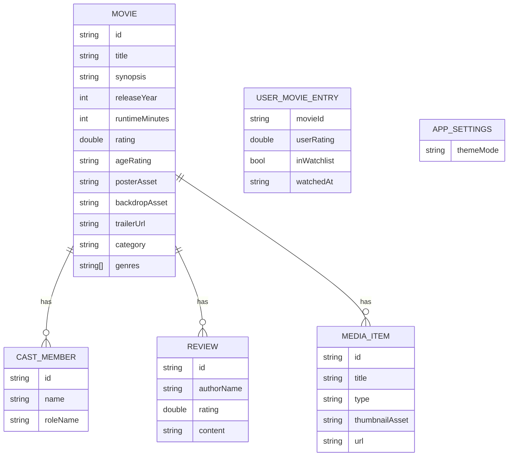

# movie-rating

## Domain Model



## Model Notes

- `Movie` is the main aggregate for list, search, and detail screens.
- `CastMember`, `Review`, and `MediaItem` are nested under `Movie` so the detail
  screen can render without a second data source.
- `UserMovieEntry` is lightweight demo profile data for ratings and watchlist.
- `AppSettings` is not stored in `movies.json`; theme mode is persisted with
  `SharedPreferences`.

## JSON Shape

```json
{
  "movies": [
    {
      "id": "neon-horizon",
      "title": "Neon Horizon",
      "synopsis": "In a world where memories are currency...",
      "releaseYear": 2024,
      "runtimeMinutes": 165,
      "rating": 8.9,
      "ageRating": "PG-13",
      "posterAsset": "assets/images/neon_horizon_poster.jpg",
      "backdropAsset": "assets/images/neon_horizon_backdrop.jpg",
      "trailerUrl": "https://example.com/trailer",
      "category": "nowPlaying",
      "genres": ["Sci-Fi", "Thriller"],
      "cast": [
        {
          "id": "elias-thorne",
          "name": "Elias Thorne",
          "roleName": "Kaelen"
        }
      ],
      "reviews": [
        {
          "id": "review-1",
          "authorName": "John Doe",
          "rating": 4.5,
          "content": "A visually stunning movie."
        }
      ],
      "mediaItems": [
        {
          "id": "trailer-1",
          "title": "Official Trailer",
          "type": "trailer",
          "thumbnailAsset": "assets/images/neon_horizon_trailer.jpg",
          "url": "https://example.com/trailer"
        }
      ]
    }
  ],
  "userMovieEntries": [
    {
      "movieId": "neon-horizon",
      "userRating": 5.0,
      "inWatchlist": true,
      "watchedAt": "2026-04-28"
    }
  ]
}
```

## Data Rules

- `Movie.id` is a stable slug used by detail navigation.
- `genres`, `cast`, `reviews`, and `mediaItems` should default to empty lists
  when missing.
- Search should match `title` and `genres` case-insensitively.
- Pagination can be derived from the loaded `movies` list in the repository.
